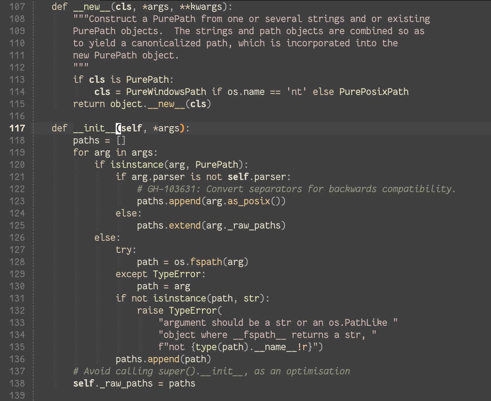

# Zenfade

Colorscheme based on the [zenbones](https://github.com/zenbones-theme/zenbones.nvim) "zenburned" variant, which in turn is based on zenburn.

## Example

### [zenburn.nvim](https://github.com/daler/zenburn.nvim)


### zenfade



## Installation


Install like any other plugin, e.g., with
[vim-plug](https://github.com/junegunn/vim-plug). Also needs the
[lush](https://github.com/rktjmp/lush.nvim) plugin.

```vim
Plug "daler/zenfade"
Plug "rktjmp/lush.nvim"
```

Or [lazy.nvim](https://github.com/folke/lazy.nvim):

```lua
require("lazy").setup({
    "daler/zenfade",
    dependencies = {"rktjmp/lush.nvim",},
    lazy = false,
    priority = 1000

})
```
## Modifying

Compared to zenburn it is a little faded and has slightly warmer palette.

Here is how to edit this (or any other) lush-based colorscheme.

- Ensure that [lush](https://github.com/rktjmp/lush.nvim/tree/main) is installed.
- Clone this repo. Open the colorscheme file, `lua/lush_theme/zenfade.lua` file in nvim.
- In `zenfade.lua`, run `:Lushify`. This will turn the file into a "live" colorscheme, changing the colors as you make edits (without even needing to save).
- (Optional) Open another file you want to use for testing colors with `:vsplit` so you can watch the effects of your edits.
- Use `:Inspect` to show the highlight under the cursor. Search for that in the colorscheme file to make changes.
- Use `C-a` and `C-x` to increase or decrease the value under the cursor -- this is extremely helpful for the hue/saturation/lightness (`hsl`) values.

Want to work with another colorscheme as a base? Open a fresh instance of nvim
with the colorscheme of interest, then run `:LushImport` and follow the
instructions. The colors will likely come in as hex, which is not as convenient
to work with as `hsl`. You can convert them by adding this function to your
nvim config and calling `:ConvertHexToHsl` which will convert the RBG hex to
`hsl()` calls.

```lua

local function hex_to_hsl(hex)
  hex = hex:gsub("#", "")
  local r = tonumber(hex:sub(1,2), 16) / 255
  local g = tonumber(hex:sub(3,4), 16) / 255
  local b = tonumber(hex:sub(5,6), 16) / 255

  local max = math.max(r, g, b)
  local min = math.min(r, g, b)
  local h, s, l = 0, 0, (max + min) / 2

  if max ~= min then
    local d = max - min
    s = l > 0.5 and d / (2 - max - min) or d / (max + min)

    if max == r then
      h = (g - b) / d + (g < b and 6 or 0)
    elseif max == g then
      h = (b - r) / d + 2
    elseif max == b then
      h = (r - g) / d + 4
    end
    h = h / 6
  end

  return math.floor(h * 360), math.floor(s * 100), math.floor(l * 100)
end

local function convert_hex_to_hsl()
  local lines = vim.api.nvim_buf_get_lines(0, 0, -1, false)
  for i, line in ipairs(lines) do
    local new_line = line:gsub('"(#%x%x%x%x%x%x)"', function(hex)
      local h, s, l = hex_to_hsl(hex)
      return string.format("hsl(%d, %d, %d)", h, s, l)
    end)
    lines[i] = new_line
  end
  vim.api.nvim_buf_set_lines(0, 0, -1, false, lines)
end

vim.api.nvim_create_user_command('ConvertHexToHsl', convert_hex_to_hsl, {})
```
